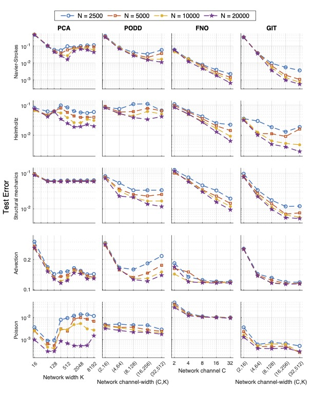
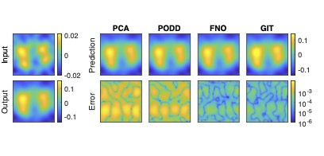
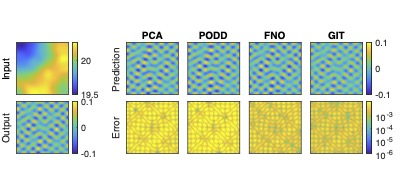
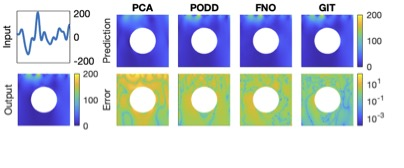
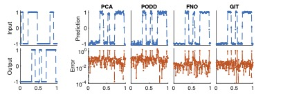
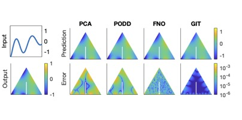
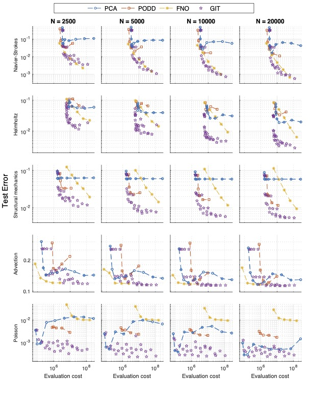

# GIT-Net: Generalized Integral Transform Neural Network for Operator Learning #


This work proposes a novel neural network, GIT-Net, for operator learning. It is demonstrated by solving several PDEs and comparing with three exsiting neural network operators, `PCA-Net`, `FNO`, and `POD-DeepOnet` from the view of test error, error profile, and evaluation cost. The original paper is "[GIT-Net: Generalized Integral Transform for Operator Learning](https://openreview.net/forum?id=0WKTmrVkd2)"

## Data (paired input-output functions) ##
The PDE problems used for validation are:
1. Navier-Stokes equation (2D, structured meshes)
2. Helmholtz equation (2D, structured meshes)
3. Structural mechanics (2D, unstructured meshes)
4. Advection equation (1D, structured meshes)
5. Poisson equation (2D, unstructured meshes)

All data for training and testing can be found in https://drive.google.com/drive/folders/1vmmPTwiIIbdOVTC209OKArcyjuYZcMHU?usp=sharing. For the problems defined in unstructured meshes, the intepolated data on a structured meshes are provided.

### Reference ###
1. The data used on problem 1, 2, and 4 are from paper _Maarten V. de Hoop, Daniel Zhengyu Huang, Elizabeth Qian, Andrew M. Stuart. "[The Cost-Accuracy Trade-Off In Operator Learning With Neural Networks](https://arxiv.org/abs/2203.13181)."_ And the original address is https://data.caltech.edu/records/20091.
2. The data used on problem 5 is generated as suggested in paper _Lu Lu, Xuhui Meng, Shengze Cai, Zhiping Mao, Somdatta Goswami, Zhongqiang Zhang, and George Em Karniadakis. "A comprehensive and fair comparison of two neural operators (with practical extensions) based on FAIR data"_.

## Code ##
### Training ###
Example of GIT-Net for Navier-Stokes equation
```
cd Navier-stokes/
python3 GIT_ns.py --c_width 32 --d_width 512 --M 2500 --state 'train' --device 0
```

### Testing ###
Example of GIT-Net for Navier-Stokes equation
```
cd Navier-stokes/
python3 GIT_ns.py --c_width 32 --d_width 512 --M 2500 --state 'eval' --path_model 'models/GIT/GIT_2500_dw_512_cw32.model' --device 0
```

## Results (comparison among GIT-Net, PCA-Net, POD-DeepOnet, and FNO) ##
### Test error ###
Test error for different amount of training data (N) and all method are shown. `C` and `K` are hyperparameters representing the size of the networks.


---

### Error profile ###
The results of the neural network model trained on N = 20000 data using hyperparameters that minimize test errors are presented, including the predictions and error profiles of the worst-error cases.


#### Navier-Stokes ####


---

#### Helmholtz equation ####




---

#### Structural Mechanics


---

#### Advection equation


---

#### Poisson equation


---

### Evalustion cost
The evaluation cost vs. test error for all methods with varying hyperparameters shown, in which evaluation cost is computed by counting floating point operations.



## Reference
**FNO**: Zongyi Li, Nikola Borislavov Kovachki, Kamyar Azizzadenesheli, Burigede liu, Kaushik Bhattacharya, Andrew Stuart, and Anima Anandkumar. "Fourier neural operator for parametric partial differential equations." _In International Conference on Learning Representations, 2021_

**PCA-Net**: Kaushik Bhattacharya; Bamdad Hosseini; Nikola B. Kovachki; Andrew M. Stuart. "Model Reduction And Neural Networks For Parametric PDEs." _The SMAI Journal of computational mathematics, Volume 7 (2021), pp. 121-157. doi : 10.5802/smai-jcm.74._

**POD-DeepOnet**: Lu, Lu, Xuhui Meng, Shengze Cai, Zhiping Mao, Somdatta Goswami, Zhongqiang Zhang, and George Em Karniadakis. "A comprehensive and fair comparison of two neural operators (with practical extensions) based on fair data." _Computer Methods in Applied Mechanics and Engineering 393 (2022): 114778._
